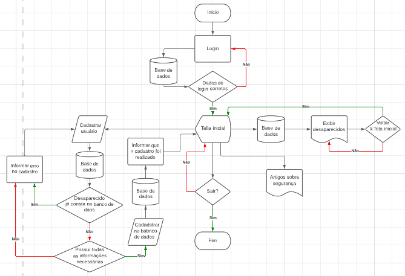
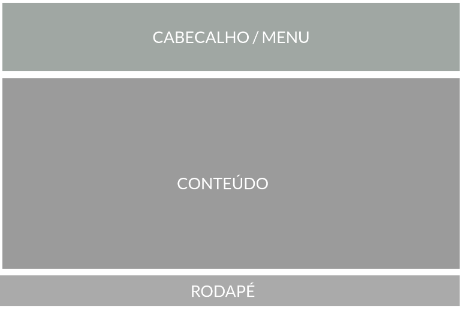
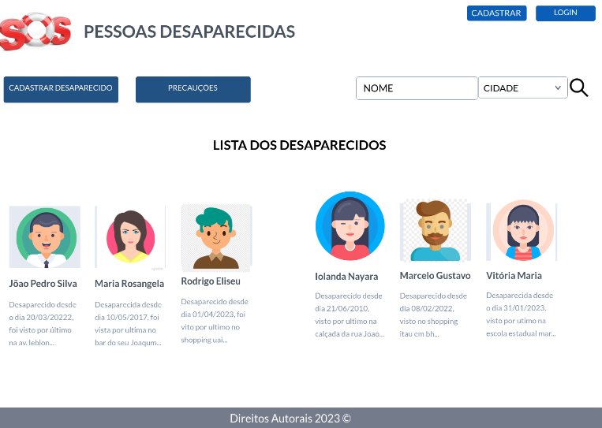
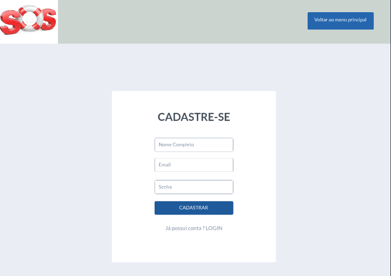
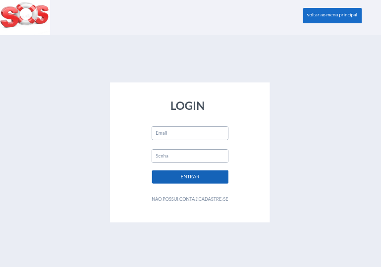
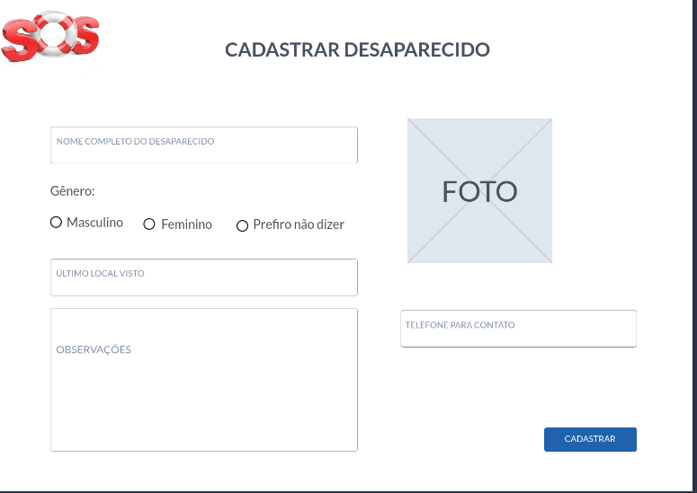
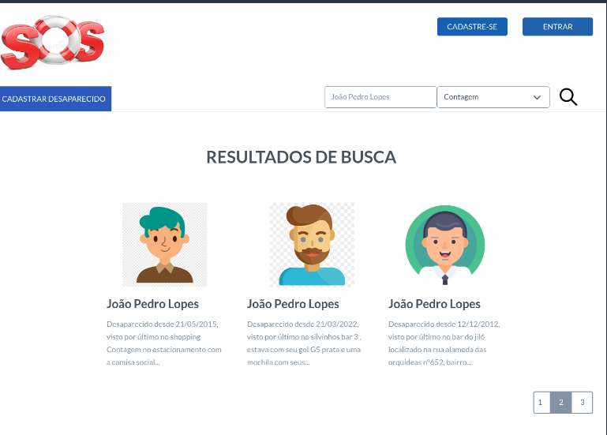

# Projeto de Interface

Pré-requisitos: <a href="2-Especificação do Projeto.md"> Documentação de Especificação</a>

Visão geral da interação do usuário pelas telas do sistema e protótipo interativo das telas com as funcionalidades que fazem parte do sistema (wireframes).

 Apresente as principais interfaces da plataforma. Discuta como ela foi elaborada de forma a atender os requisitos funcionais, não funcionais e histórias de usuário abordados nas <a href="2-Especificação do Projeto.md"> Documentação de Especificação</a>.

## Diagrama de Fluxo

O diagrama apresenta o estudo do fluxo de interação do usuário com o sistema interativo e  muitas vezes sem a necessidade do desenho do design das telas da interface. Isso permite que o design das interações seja bem planejado e gere impacto na qualidade no design do wireframe interativo que será desenvolvido logo em seguida.

As referências abaixo irão auxiliá-lo na geração do artefato “Diagramas de Fluxo”.

> **Links Úteis**:
> - [Fluxograma online: seis sites para fazer gráfico sem instalar nada | Produtividade | TechTudo](https://www.techtudo.com.br/listas/2019/03/fluxograma-online-seis-sites-para-fazer-grafico-sem-instalar-nada.ghtml)

## Wireframes

### Wireframe Interativo
Conforme o diagrama de fluxo do projeto, apresentado no item anterior, as telas do sistema são apresentadas em detalhes nos itens que se seguem. Para visualizar o wireframe
interativo, acesse o ambiente MarvelApp do projeto.
As telas do sistema apresentam uma estrutura comum que é apresentada na Figura X.
Nesta estrutura, existem 3 grandes blocos, descritos a seguir. São eles: 
● Cabeçalho/menu - local onde são dispostos elementos fixos de identidade (logo), opção de cadastrar e opção de logar. No menu temos a opção de cadastrar um desaparecido e opção de filtrar um desaparecido por nome e cidade. 
● Conteúdo - apresenta o conteúdo com os últimos desaparecidos cadastrados; 
● Rodapé - direitos autorais, copyright.

### Tela - Home-Page
A tela de home-page apresenta as opções para cadastro ou login de usuário como cadastro do desaparecido e a opção de filtros, dentre as principais funções podemos citar: 
● Componente de pesquisa que permite encontrar o cadastro do daparecido com mais facilidade; 
● Componente de cadastro e login para que possa ser identificado e organizado o cadastro do desaparecido; 
● Componente de conteudo onde fica o cadastro dos desaparecidos de acordo com a data e hora cadastrados.

### Tela - Cadastro
A tela de cadastro foi criada para que o usuário que deseja cadastrar um desaparecido possa ter um perfil além de filtar para que não seja realizado cadastros sem infrormações corretas.

### Tela -  Login
Assim que o usuário realizar o cadastro ele poderá logar e ter acesso as funcionalidades do nosso site e poderá cadastrar um ente querido ou amigo que desapareceu.

### Tela - Cadastro Desaparecido
A tela de cadastro de desaparecido é fundamental, pois com ela o usuário vai inserir as informações do seu ente querido como a data, hora, dia, visto por último, último local visto, dentre outras informações para ajudar na busca.

### Tela - Resutados de Buscas
A tela de resultados de buscas foi criada para que o usuário possa encontrar com base no filtro o usuário que ela cadastrou com mais facilidade.

### Tela - Preucações
A tela obtém informações de preucações para ajudar as pessoas que desapareceram por motivos que podem ser evitados.

São protótipos usados em design de interface para sugerir a estrutura de um site web e seu relacionamentos entre suas páginas. Um wireframe web é uma ilustração semelhante do layout de elementos fundamentais na interface.
 
> **Links Úteis**:
> - [Protótipos vs Wireframes](https://www.nngroup.com/videos/prototypes-vs-wireframes-ux-projects/)
> - [Ferramentas de Wireframes](https://rockcontent.com/blog/wireframes/)
> - [MarvelApp](https://marvelapp.com/developers/documentation/tutorials/)
> - [Figma](https://www.figma.com/)
> - [Adobe XD](https://www.adobe.com/br/products/xd.html#scroll)
> - [Axure](https://www.axure.com/edu) (Licença Educacional)
> - [InvisionApp](https://www.invisionapp.com/) (Licença Educacional)
